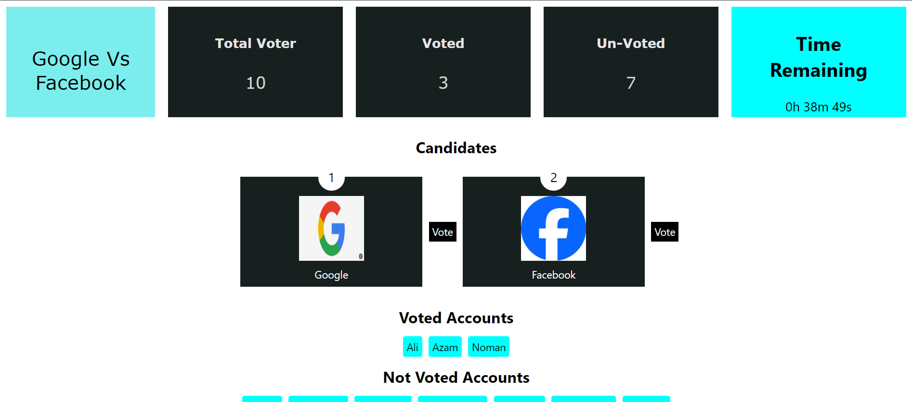

# D-Voting App



D-Voting App is a decentralized voting application that allows users to participate in secure and transparent voting processes.

## Features

- **Secure Voting**: Ensures that votes are securely cast and counted.
- **Transparency**: Provides a transparent process where all votes can be verified.
- **Decentralized**: Utilizes blockchain technology to maintain the integrity of the voting process.

## Prerequisites

Before you begin, ensure you have met the following requirements:

- You have installed Node.js and npm.
- You have installed Truffle by running `npm install -g truffle`.
- You have installed Ganache, a personal blockchain for Ethereum development

## Compile Contract 

truffle compile

## Deploy Contract 

truffle migrate --reset

## Installation

Follow these steps to install and run the D-Voting App locally:

1. Clone the repository:

    ```bash
    git clone <REPOSITORY_URL>
    cd d-voting-app
    ```

2. Install dependencies:

    ```bash
    npm install
    ```

3. Start the application:

    ```bash
    npm start
    ```

## Usage

1. Open your browser and navigate to `http://localhost:3000`.
2. Register an account or log in.
3. Participate in ongoing votes or create a new vote.


### Frontend

To compile the frontend project, run:

```bash
npm run build
